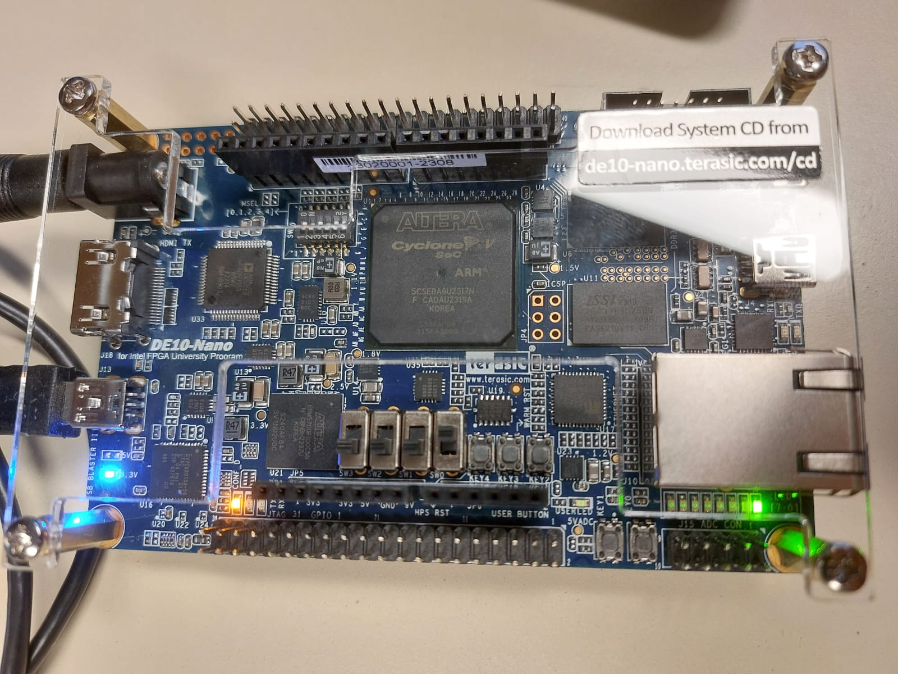
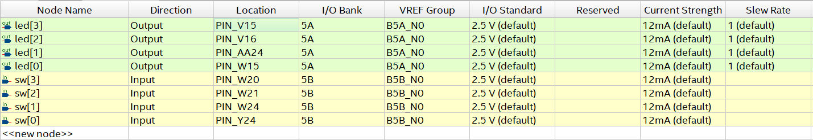
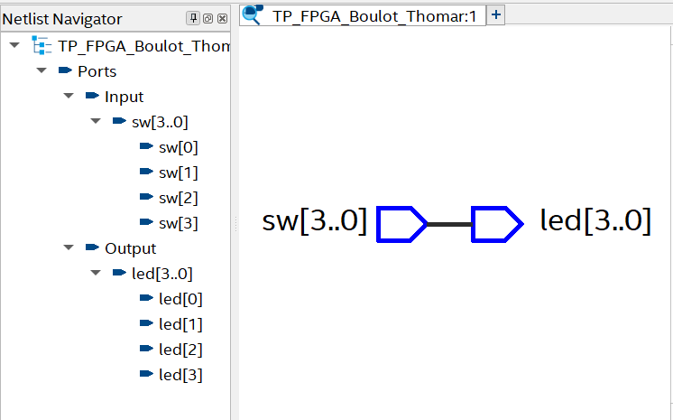
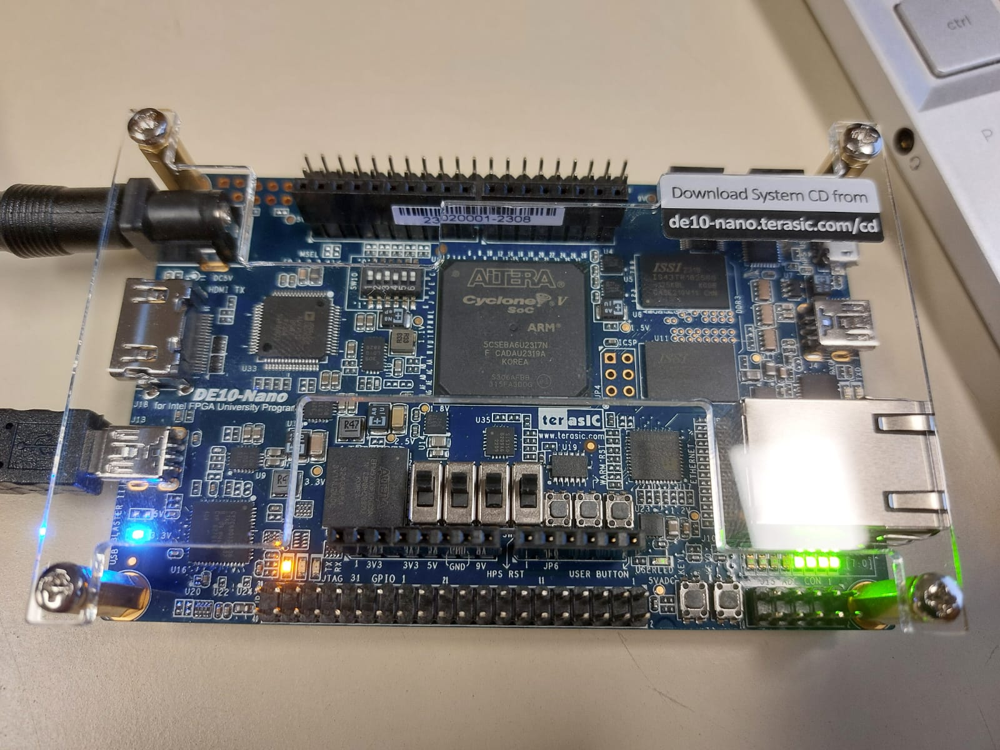

<p align="center">  </p>

# TP FPGA  

Ce TP FPGA est réalisé par Jean-Philippe THOMAR et Paul BOULOT, sous la supervision de N. PAPAZOGLOU.

# Objectifs : 
Durant ces séances de TP, nous allons nous servir de la carte DE10-Nano de Terasic, en utilisant la sortie HDMI, pour faire rebondir le logo ENSEA, comme dans les lecteurs DVD (https://www.bouncingdvdlogo.com/).  
Mais en premier lieu, nous allons prendre en main le logiciel Quartus qui permet de tester les composants sur FPGA. 

## 1. Tutoriel Quartus
L'objectif de cette première partie est de prendre en main le logiciel Quartus en réalisant un chenillard avec les LEDs de la carte 
### Création d’un projet
Premièrement, on crée un projet TP_FPGA_Boulot_Thomar et on sélectionne le FPGA suivant : 5CSEBA6U23I7

### Création d’un fichier VHDL
On crée ensuite un fichier VHDL dans lequel nous écrivons le composant suivant : 
```vhd
library ieee;
use ieee.std_logic_1164.all;
entity TP_FPGA_Boulot_Thomar is
port (
sw : in std_logic;
led : out std_logic
);
end entity TP_FPGA_Boulot_Thomar;
architecture rtl of TP_FPGA_Boulot_Thomar is
begin
led <= sw;
end architecture rtl;
```
Ce script VHDL décrit un module appelé TP_FPGA_Boulot_Thomar. Il définit deux ports : une entrée sw (un commutateur) et une sortie led, tous deux de type std_logic. L'architecture nommée rtl relie directement l'entrée à la sortie (led <= sw;). Ainsi, l'état du commutateur contrôle directement l'état de la LED.

### Fichier de contrainte
LED0 : PIN_W15  
SW0 : PIN_Y24  
Nous modifions le fichier de contrainte de manière à ce que le logiciel prenne en compte l'association de pin précédente   

### Programmation de la carte
On compile l'intégralité du projet, on sélectionne la puce 5CSEBA6 dans Tools > Programmer, on charge le bitstream, et on programme la carte en clquant sur le bouton Start.   
On peut alors contrôler la LED0 avec le switch SW0 de la carte. 
<p align="center">  </p>

### Modification du VHDL pour controler 4 LEDs avec des swtiches
On remplace dans le code nos std_logic par des std_logic_vector :   

```vhd
library ieee;
use ieee.std_logic_1164.all;
entity TP_FPGA_Boulot_Thomar is
port (
sw : in std_logic_vector(3 downto 0);
led : out std_logic_vector(3 downto 0)
);
end entity TP_FPGA_Boulot_Thomar;
architecture rtl of TP_FPGA_Boulot_Thomar is
begin
led <= sw;
end architecture rtl;
```
On modifie notre fichier contrainte pour associer les 4 leds aux 4 switches : 
<p align="center">  </p>
<p align="center">  </p>

Cela nous permet alors de contrôler 4 leds.
<p align="center">  </p>


### Faire clignoter une LED

Miantenant, pour faire clignoter une led nous avons besoin d'un signal d'horloge et nous allons utiliser la FPGA_CLK1_50 qui est sur le PIN_V11  
Schéma correspondant au code VHDL:  
<p align="center">  </p>

Le code fournie fait clignoter la led à 50 MHz, ce qui est beaucoup trop rapide. On modifie le code pour la faire clignoter plus lentement : 
```vhd
library ieee;
use ieee.std_logic_1164.all;
entity led_blink is
	port (
		i_clk : in std_logic;
		i_rst_n : in std_logic;
		o_led : out std_logic
	);
end entity led_blink;

architecture rtl of led_blink is
	signal r_led : std_logic := '0';
begin
	process(i_clk, i_rst_n)
		variable counter : natural range 0 to 5000000 := 0;
	begin
		if (i_rst_n = '0') then
			counter := 0;
			r_led <= '0';
		elsif (rising_edge(i_clk)) then
			if (counter = 5000000) then
				counter := 0;
				r_led <= not r_led;
			else
				counter := counter + 1;
			end if;
		end if;
	end process;
	o_led <= r_led;
end architecture rtl;
```
Le bouton KEY0 est connecté au PIN_AH17_n. Le _n signifie que le pin est actif à l'état bas. Cela veut dire que le signal est considéré comme actif (ou déclenche une action) lorsque sa valeur est 0 logique, et qu'il est inactif lorsqu'il est à 1 logique.


### Chenillard 

Il est maintenant question d'utiliser les connaissances que nous avons apprises jusqu'alors pour réaliser un chenillard.


## 2. Petit projet : Bouncing ENSEA Logo
