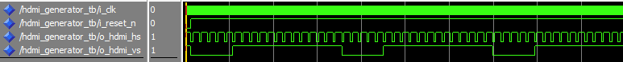

<p align="center">  </p>

# TP FPGA  

Ce TP FPGA est réalisé par Jean-Philippe THOMAR et Paul BOULOT, sous la supervision de N. PAPAZOGLOU.

# Objectifs : 
Durant ces séances de TP, nous allons nous servir de la carte DE10-Nano de Terasic, en utilisant la sortie HDMI, pour faire rebondir le logo ENSEA, comme dans les lecteurs DVD (https://www.bouncingdvdlogo.com/).  
Mais en premier lieu, nous allons prendre en main le logiciel Quartus qui permet de tester les composants sur FPGA. 

## 1. Tutoriel Quartus
L'objectif de cette première partie est de prendre en main le logiciel Quartus en réalisant un chenillard avec les LEDs de la carte 
### 1.1 Création d’un projet
Premièrement, on crée un projet TP_FPGA_Boulot_Thomar et on sélectionne le FPGA suivant : 5CSEBA6U23I7

### 1.2 Création d’un fichier VHDL
On crée ensuite un fichier VHDL dans lequel nous écrivons le composant suivant : 
```vhd
library ieee;
use ieee.std_logic_1164.all;
entity TP_FPGA_Boulot_Thomar is
port (
sw : in std_logic;
led : out std_logic
);
end entity TP_FPGA_Boulot_Thomar;
architecture rtl of TP_FPGA_Boulot_Thomar is
begin
led <= sw;
end architecture rtl;
```
Ce script VHDL décrit un module appelé TP_FPGA_Boulot_Thomar. Il définit deux ports : une entrée sw (un commutateur) et une sortie led, tous deux de type std_logic. L'architecture nommée rtl relie directement l'entrée à la sortie (led <= sw;). Ainsi, l'état du commutateur contrôle directement l'état de la LED.

### 1.3 Fichier de contrainte
LED0 : PIN_W15  
SW0 : PIN_Y24  
Nous modifions le fichier de contrainte de manière à ce que le logiciel prenne en compte l'association de pin précédente   

### 1.4 Programmation de la carte
On compile l'intégralité du projet, on sélectionne la puce 5CSEBA6 dans Tools > Programmer, on charge le bitstream, et on programme la carte en clquant sur le bouton Start.   
On peut alors contrôler la LED0 avec le switch SW0 de la carte. 
<p align="center">  </p>

### 1.5 Modification du VHDL pour controler 4 LEDs avec des swtiches
On remplace dans le code nos std_logic par des std_logic_vector :   

```vhd
library ieee;
use ieee.std_logic_1164.all;
entity TP_FPGA_Boulot_Thomar is
port (
sw : in std_logic_vector(3 downto 0);
led : out std_logic_vector(3 downto 0)
);
end entity TP_FPGA_Boulot_Thomar;
architecture rtl of TP_FPGA_Boulot_Thomar is
begin
led <= sw;
end architecture rtl;
```
On modifie notre fichier contrainte pour associer les 4 leds aux 4 switches : 
<p align="center">  </p>
<p align="center">  </p>

Cela nous permet alors de contrôler 4 leds.
<p align="center">  </p>


### 1.6 Faire clignoter une LED

Miantenant, pour faire clignoter une led nous avons besoin d'un signal d'horloge et nous allons utiliser la FPGA_CLK1_50 qui est sur le PIN_V11  
Schéma correspondant au code VHDL:  
<p align="center">  </p>

Le code fournie fait clignoter la led à 50 MHz, ce qui est beaucoup trop rapide. On modifie le code pour la faire clignoter plus lentement : 
```vhd
library ieee;
use ieee.std_logic_1164.all;
entity led_blink is
	port (
		i_clk : in std_logic;
		i_rst_n : in std_logic;
		o_led : out std_logic
	);
end entity led_blink;

architecture rtl of led_blink is
	signal r_led : std_logic := '0';
begin
	process(i_clk, i_rst_n)
		variable counter : natural range 0 to 5000000 := 0;
	begin
		if (i_rst_n = '0') then
			counter := 0;
			r_led <= '0';
		elsif (rising_edge(i_clk)) then
			if (counter = 5000000) then
				counter := 0;
				r_led <= not r_led;
			else
				counter := counter + 1;
			end if;
		end if;
	end process;
	o_led <= r_led;
end architecture rtl;
```
Le bouton KEY0 est connecté au PIN_AH17_n. Le _n signifie que le pin est actif à l'état bas. Cela veut dire que le signal est considéré comme actif (ou déclenche une action) lorsque sa valeur est 0 logique, et qu'il est inactif lorsqu'il est à 1 logique.


### 1.7 Chenillard 

Il est maintenant question d'utiliser les connaissances que nous avons apprises jusqu'alors pour réaliser un chenillard.

```vhd
library ieee;
use ieee.std_logic_1164.all;
use ieee.numeric_std.all;
entity chenillard is
    Port (
        i_clk     : in  std_logic; -- Horloge d'entrée
        i_rst_n   : in  std_logic; -- Réinitialisation active bas
        o_leds    : out unsigned(7 downto 0) -- LEDs du chenillard
    );
end chenillard;

architecture rtl of chenillard is
    signal r_leds      : unsigned(7 downto 0) := "00000000"; -- État interne des LEDs
begin

    -- Division de fréquence pour ralentir l'horloge
    process(i_clk, i_rst_n)
		variable counter : natural range 0 to 5000000 := 0;
    begin
        if (i_rst_n = '0') then
            counter := 0;
            r_leds <= "00000000";
        elsif rising_edge(i_clk) then
				if (r_leds = "00000000") then
					r_leds <= "00000001";
				end if;
				if (counter = 5000000) then
					counter := 0;
					r_leds <= shift_left(r_leds, 1);
				else
					counter := counter + 1;
				end if;			       
        end if;
   end process;
	o_leds <= r_leds;
end rtl;
```


## 2. Petit projet : Bouncing ENSEA Logo
L'objectif de cette partie est de faire rebondir le logo ENSEA sur la sortie HDMI, comme dans les
lecteurs DVD.

### Analysez l’entity

Paramètres de résolution :

	h_res = 720 : Résolution horizontale

	v_res = 480 : Résolution verticale

Paramètres de timing horizontal :

	h_sync = 61 : Durée de l'impulsion de synchronisation horizontale

	h_fp = 58 : Front porch horizontal

	h_bp = 18 : Back porch horizontal

Paramètres de timing vertical :

	v_sync = 5 : Durée de l'impulsion de synchronisation verticale

	v_fp = 30 : Front porch vertical

	v_bp = 9 : Back porch vertical

### Rôle des autres signaux

Signaux d'entrée :

	i_clk : Signal d'horloge

	i_reset_n : Signal de réinitialisation asynchrone actif à l'état bas (reset)

Signaux de synchronisation HDMI :

	o_hdmi_hs : Signal de synchronisation horizontale

	o_hdmi_vs : Signal de synchronisation verticale

	o_hdmi_de : Signal qui indique quand les pixels sont dans la zone active

Signaux de gestion des pixels :

	o_pixel_en : Signal d'activation indiquant quand un pixel doit être affiché

	o_pixel_address : Adresse linéaire du pixel courant

Signaux de position :

	o_x_counter : Position horizontale dans la zone active

	o_y_counter : Position verticale dans la zone active

	o_pixel_pos_x : Position X du pixel courant

	o_pixel_pos_y : Position Y du pixel courant

Signal de synchronisation de trame :

	o_new_frame : Signal indiquant le début d'une nouvelle trame (cf image)

### 1. Boucle horizontale

```vhd
architecture rtl of hdmi_generator is
    -- Taille horizontale totale
    constant h_total : natural := h_sync + h_res + h_fp + h_bp;

    -- Compteur horizontal
    signal h_count : natural range 0 to h_total-1 := 0;
begin

    process(i_clk, i_reset_n)
    begin 
        if (i_reset_n = '0') then
            h_count <= 0;
            o_hdmi_hs <= '1'; -- Valeur par défaut
        elsif rising_edge(i_clk) then 
            if (h_count = h_total-1) then
                h_count <= 0;
            else
                h_count <= h_count + 1;
            end if;

            -- Génération de la synchronisation horizontale
            if (h_count < h_sync) then 
                o_hdmi_hs <= '0';
            else
                o_hdmi_hs <= '1';
            end if;
        end if;
    end process;

end architecture rtl;
```

### 2. Testbench pour la boucle horizontale
On simulera le composant à l'aide de MODELSIM.
On utilse un testbench dont voici un extrait ci-dessous.

```vhd
-- Clock generation
process
begin
while (finished = '0') loop
    i_clk <= '0'; wait for 1 us;
    i_clk <= '1'; wait for 1 us;
end loop;
wait;
end process;

-- Reset and simulation control
process
begin
i_reset_n <= '0'; wait for 25 us;
i_reset_n <= '1'; wait for 2 ms;
finished <= '1';
wait; 
end process;
```
On visualise les signaux d'entrée i_clk et i_reset_n et la sortie _ohdmi_hs.

<p align="center">  </p>

### 3. Boucle verticale 

```vhd
architecture rtl of hdmi_generator is
    -- Taille horizontale totale
    constant h_total : natural := h_sync + h_res + h_fp + h_bp;
    -- Compteur horizontal
    signal h_count : natural range 0 to h_total-1 := 0;
	 
	 -- Taille verticale
	 constant v_total : natural := v_sync + v_res + v_fp + v_bp;
	 -- Compteur vertical
	 signal v_count : natural range 0 to v_total-1 := 0;
	 
begin

    process(i_clk, i_reset_n)
    begin 
	 
        if (i_reset_n = '0') then
            h_count <= 0;
				v_count <= 0;
            o_hdmi_hs <= '1'; -- Valeurs par défaut
				o_hdmi_vs <= '1';
        elsif rising_edge(i_clk) then 
		  
				if (v_count = v_total-1) then 
					v_count <= 0;
				else
					if (h_count = h_total-1) then
						 h_count <= 0;
						 v_count <= v_count + 1;
					else
						 h_count <= h_count + 1;
					end if;

					-- Génération de la synchronisation horizontale
					if (h_count < h_sync) then 
						 o_hdmi_hs <= '0';
					else
						 o_hdmi_hs <= '1';
					end if;
				end if;
				
				--Géneration de la synchronisation verticale
				if (v_count < v_sync) then 
					o_hdmi_vs <= '0';
				else 
					o_hdmi_vs <= '1';
				end if;
        end if;
		  
    end process;
end architecture rtl;
```

### 4. Testbench pour le compteur vertical
On peut conserver le mêmee testbench mais on visualise le signal o_hdmi_vs en plus.
<p align="center">  </p>

### 5. Zone active
Les zone active sont telles que h_count et v_count respectent les conditions suivantes :  

```vhd
h_count >= (h_sync + h_bp) and h_count < (h_sync + h_bp + h_res)  
v_count >= (v_sync + v_bp) and v_count < (v_sync + v_bp + v_res)  
```
On peut alors les implémenter les signaux h_act et v_act comme suit :

```vhd
--Zone active
signal h_act : natural range 0 to h_total-1 := 0;
signal v_act : natural range 0 to v_total-1 := 0;
```
```vhd
--Calcul des positions actives 
process(h_count, v_count)
begin
	if (h_count >= (h_sync + h_bp) and h_count < (h_sync + h_bp + h_res)) then 
		h_act <= h_count - (h_sync + h_bp);
	else
		h_act <= 0;
	end if
	
	if (v_count >= (v_sync + v_bp) and v_count < (v_sync + v_bp + v_res)) then 
		v_act <= v_count - (v_sync + v_bp);
	else
		v_act <= 0;
	end if 
end process;
```
